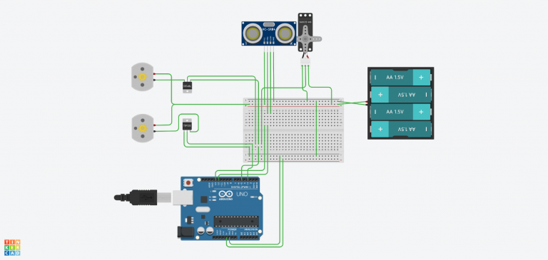

## Arduino Autonomous Object-Avoiding Vehicle
Developed in C using Arduino platform, this was a project created for 
learning purposes to get an insight into Arduino and to practice usage 
of a 3D printer.

### Hardware
- Arduino UNO
- Tower Pro MG996R Servo Motor
- Texas Instruments ULN2003AN Transistor IC
- HC-SR04 Ultrasonic Sensor
- 2x DC Motor w/ Wheels
- 3D Printer
- Breadboard
- Lots of wiring

### Body
- The body was a simple design in AutoCAD with a Arduino UNO holder via 
screw holes. 
- Other components were hot glued onto the polymer body.
- The design consisted of a three wheel system, two rear driving motors 
and a trolley wheel in the front.
- The trolley wheel was 3D printed and designed in such a way to allow 
free rotation of the front wheel.
- The sonar sensor was attached to the servo motor using a custom holder 
3D printed to fit the motor attachment.

### Algorithm
Designed using a simple, and most likely inefficient algorithm, to 
browse its surroundings in 45deg scan interval and determine the path 
of least obstacles.

### Circuit
- The circuit was relatively simple. The servo motor and DC Motors were 
powered with an external power source, controlled via a Darlington 
transistor array IC. A common ground was utilized between Arduino and 
power source. See overview of circuit below. 

### To use
Fork the repo, upload to Arduino, download .stl files and 3D 
print, connect pins as indicated in code following circuit design as 
shown.

### TODO
- Design smarter algorithm with higher frequency scan interval

